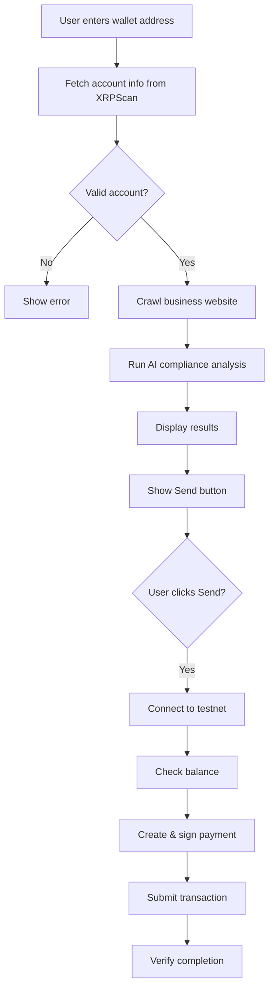

# XRP Testnet Integration

The XRP Transaction Risk AI platform integrates with both the XRP Ledger testnet and production APIs to provide comprehensive wallet analysis and transaction capabilities.

## API Endpoints

The platform uses two primary endpoints:

<CardGroup cols={2}>
  <Card title="XRPScan API" icon="magnifying-glass">
    **Production Data**
    ```
    https://api.xrpscan.com/api/v1/account/{address}
    ```
    Used for account information retrieval
  </Card>
  <Card title="Ripple Testnet" icon="flask">
    **Test Network**
    ```
    https://s.altnet.rippletest.net:51234/
    ```
    Used for test XRP transactions
  </Card>
</CardGroup>

## Account Information Retrieval

The system retrieves detailed wallet information from the XRPScan API:

```python
def get_xrp_info(address):
    url = f"https://api.xrpscan.com/api/v1/account/{address}"
    
    response = requests.get(url)
    if response.status_code == 200:
        account_info = response.json()
        st.write(account_info)
        if 'accountName' not in account_info or account_info['accountName'] is None:
            return None, None, None, None, None  # No accountName, return early
        
        domain = account_info['accountName'].get('domain', None)
        verified = account_info.get('accountName', {}).get('verified', False)
        twitter = account_info['accountName'].get('twitter', None)
        balance = account_info.get('xrpBalance', None)
        initial_balance = account_info.get('initial_balance', None)
        return verified, domain, twitter, balance, initial_balance
    else:
        st.error(f"Error fetching data: {response.status_code}")
        return None, None, None, None, None
```

<Info>
  **Source location:** ripple_challange.py:51-69
</Info>

### Retrieved Data Fields

<Accordion title="Account Information Structure">
  **Returned Values:**
  
  | Field | Type | Description |
  |-------|------|-------------|
  | `verified` | boolean | Whether the account is verified by XRPScan |
  | `domain` | string | Associated domain name (for business accounts) |
  | `twitter` | string | Linked Twitter handle |
  | `balance` | string | Current XRP balance |
  | `initial_balance` | string | Balance when account was created |

  **Example Response:**
  ```json
  {
    "accountName": {
      "domain": "example.com",
      "verified": true,
      "twitter": "@example"
    },
    "xrpBalance": "1000.5",
    "initial_balance": "20.0"
  }
  ```
</Accordion>

## User Input Form

The platform collects transaction details through a Streamlit form:

```python
with emp.form("Magic form"):
    # User Inputs
    wallet_address = st.text_input(
        "Enter your destination XRP wallet address", 
        placeholder="e.g., rMdG3ju8pgyVh29ELPWaDuA74CpWW6Fxns"
    )
    amount_xrp = st.number_input(
        "Enter the XRP amount that you would like to send!"
    )
    submitted = st.form_submit_button("Check Destination ✨✨")

    if submitted:
        with st.spinner('Fetching account information...'):
            verified, domain, twitter, balance, initial_balance = get_xrp_info(wallet_address)
```

<Tip>
  The form validates wallet addresses and ensures sufficient account information exists before proceeding with compliance analysis.
</Tip>

## Validation Logic

The system performs multiple validation checks:

<Tabs>
  <Tab title="Domain Check">
    ```python
    if not domain:
        st.error("No info")
        return
    ```
    
    **Purpose:** Ensures the wallet has an associated business entity that can be analyzed for compliance.
  </Tab>

  <Tab title="Information Completeness">
    ```python
    if not twitter or not balance or not initial_balance:
        st.error("There is no sufficient information available for this address.")
        return

    st.success('Account information retrieved successfully!')
    ```
    
    **Purpose:** Verifies that enough data exists to perform meaningful risk assessment.
  </Tab>

  <Tab title="Success State">
    Only after all validations pass does the system proceed to:
    1. Crawl the associated business website
    2. Run AI compliance analysis
    3. Display results and enable transaction button
  </Tab>
</Tabs>

## Sending XRP Testnet Transactions

After compliance approval, users can send test XRP using the testnet:

```python
def send_xrp_test(destination_address, amount_xrp):
    JSON_RPC_URL = "https://s.altnet.rippletest.net:51234/"
    client = JsonRpcClient(JSON_RPC_URL)
    
    # Create a wallet from the testnet credentials
    test_wallet = Wallet.from_seed(test_wallet_secret)

    # Define the destination address and amount to send (in drops, 1 XRP = 1,000,000 drops)
    destination_address = destination_address
    amount_to_send = amount_xrp  # Example: sending 5 XRP (5,000,000 drops)

    # Check the balance of the sender account before the transaction
    account_info = AccountInfo(
        account=test_wallet.classic_address,
        ledger_index="validated"
    )
    response = client.request(account_info)
    print(f"Balance before transaction: {response.result['account_data']['Balance']} drops")

    # Prepare the payment transaction
    payment_tx = Payment(
        account=test_wallet.classic_address,
        amount=amount_to_send,
        destination=destination_address
    )

    # Sign and autofill the transaction
    signed_tx = autofill_and_sign(payment_tx, client, test_wallet)

    # Submit the transaction
    response = submit_and_wait(signed_tx, client)

    # Check the balance of the sender account after the transaction
    response = client.request(account_info)
```

<Info>
  **Source location:** ripple_challange.py:16-49
</Info>

### Transaction Workflow

<Steps>
  <Step title="Initialize Client">
    Connect to the XRP Ledger testnet using `JsonRpcClient`:
    ```python
    JSON_RPC_URL = "https://s.altnet.rippletest.net:51234/"
    client = JsonRpcClient(JSON_RPC_URL)
    ```
  </Step>

  <Step title="Load Wallet Credentials">
    Create wallet instance from stored seed:
    ```python
    test_wallet = Wallet.from_seed(test_wallet_secret)
    ```
    
    <Note>
      Credentials are stored in Streamlit secrets: `TEST_WALLET_ADDRESS` and `TEST_WALLET_SECRET`
    </Note>
  </Step>

  <Step title="Check Balance">
    Verify sufficient funds before transaction:
    ```python
    account_info = AccountInfo(
        account=test_wallet.classic_address,
        ledger_index="validated"
    )
    response = client.request(account_info)
    print(f"Balance before transaction: {response.result['account_data']['Balance']} drops")
    ```
  </Step>

  <Step title="Create Payment">
    Construct the payment transaction:
    ```python
    payment_tx = Payment(
        account=test_wallet.classic_address,
        amount=amount_to_send,
        destination=destination_address
    )
    ```
  </Step>

  <Step title="Sign & Submit">
    Sign with wallet and submit to ledger:
    ```python
    signed_tx = autofill_and_sign(payment_tx, client, test_wallet)
    response = submit_and_wait(signed_tx, client)
    ```
  </Step>

  <Step title="Verify">
    Check post-transaction balance:
    ```python
    response = client.request(account_info)
    ```
  </Step>
</Steps>

## XRP Amount Conversion

<Accordion title="Drops to XRP Conversion">
  **Important Unit Conversion:**
  
  The XRP Ledger uses "drops" as its base unit:
  - **1 XRP = 1,000,000 drops**
  - Minimum transaction amount: 1 drop
  - Maximum precision: 6 decimal places

  ```python
  # Example conversions
  amount_to_send = amount_xrp  # User enters XRP amount
  # The xrpl library handles conversion automatically
  ```

  <Note>
    The `xrpl` library automatically handles drops conversion when you pass XRP amounts as strings or numbers.
  </Note>
</Accordion>

## Transaction Button

The send button is displayed after compliance analysis completes:

```python
send_xrp_container = st.container()
with send_xrp_container:
    if st.button("Send the amount"):
        send_xrp_test(wallet_address, amount_xrp)
```

<Warning>
  The button appears regardless of compliance results. In a production environment, you should conditionally enable/disable this based on the risk assessment outcome.
</Warning>

## XRPL Python Library Integration

The platform uses the official XRPL Python SDK:

```python
import xrpl
from xrpl.clients import JsonRpcClient
from xrpl.wallet import Wallet
from xrpl.transaction import autofill_and_sign, sign_and_submit, submit_and_wait
from xrpl.models.transactions import Payment
from xrpl.models.requests import AccountInfo
```

<Accordion title="Key XRPL Components">
  **Used Classes and Functions:**

  - **`JsonRpcClient`**: Connects to XRP Ledger nodes via JSON-RPC
  - **`Wallet`**: Manages cryptographic keys and signing
  - **`Payment`**: Transaction model for sending XRP
  - **`AccountInfo`**: Request model for account data
  - **`autofill_and_sign`**: Fills transaction fields and signs
  - **`submit_and_wait`**: Submits tx and waits for validation

  These provide a high-level interface to the XRP Ledger protocol.
</Accordion>

## Credential Management

Sensitive credentials are stored in Streamlit secrets:

```python
test_wallet_address = st.secrets["TEST_WALLET_ADDRESS"]
test_wallet_secret = st.secrets["TEST_WALLET_SECRET"]
```

<Tip>
  **Security Best Practice:**
  
  Never hardcode wallet seeds or private keys. Use environment variables or secrets management:
  - Streamlit Cloud: Use secrets management UI
  - Local development: `.streamlit/secrets.toml` file
  - Production: Vault, AWS Secrets Manager, etc.
</Tip>

## Complete User Journey



## Error Handling

<Tabs>
  <Tab title="API Errors">
    ```python
    response = requests.get(url)
    if response.status_code == 200:
        # Process data
    else:
        st.error(f"Error fetching data: {response.status_code}")
        return None, None, None, None, None
    ```
  </Tab>

  <Tab title="Validation Errors">
    ```python
    if 'accountName' not in account_info or account_info['accountName'] is None:
        return None, None, None, None, None
    ```
  </Tab>

  <Tab title="Network Errors">
    ```python
    try:
        res = requests.get(url)
        if res.status_code == 200:
            return res.text
        else:
            return None
    except requests.RequestException as e:
        print(f"Request failed: {e}")
        return None
    ```
    
    From crawl_util.py:18-27
  </Tab>
</Tabs>

## Next Steps

<CardGroup cols={2}>
  <Card title="Risk Assessment" icon="chart-line" href="/features/risk-assessment">
    Learn about the AI risk analysis workflow
  </Card>
  <Card title="Regulatory Compliance" icon="scale-balanced" href="/features/regulatory-compliance">
    Understand compliance checking and reporting
  </Card>
</CardGroup>